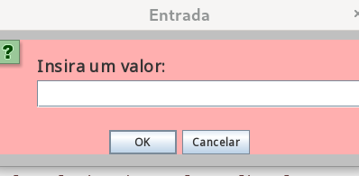
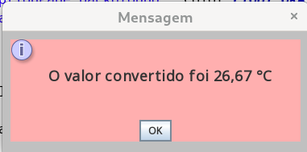

<h1 align="center"> Conversor de Moedas e Temperaturas </h1>
<h2 align="center"> Este projeto foi  feito para o Sprint 01 - Challenge ONE Java após o término da formação Java e Orientação a Objetos F2T2 - ONE </h2> 

  

   

	

 

<h2>  Tools and Technologies</h2>

      

 

Foram utilizados o framework Swing e a classe UIMAnager.

Converte moedas nos seguintes formatos:
				De Reais a Dólares
                De Reais a Euros
                De Reais a Libras Esterlinas
                De Reais a Peso Argentino
                De Reais a Peso Chileno
                De Dólares a Reais
                De Euros a Reais
                De Libras Esterlinas a Reais
                De Peso Argentino a Reais
                De Peso Chileno a Reais
                
e temperaturas:  

				De Celsius para Fahrenheit
				De Fahrenheit para Celsius
				De Celsius para Kelvin
				De Kelvin para Celsius  
           
                
O valor das moedas é fixo, obtidos na internet no dia 10/10/2022

<h2> Telas do Aplicativo </h2>
 

                    

